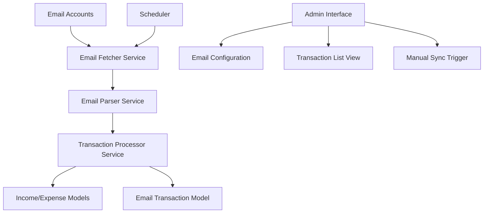
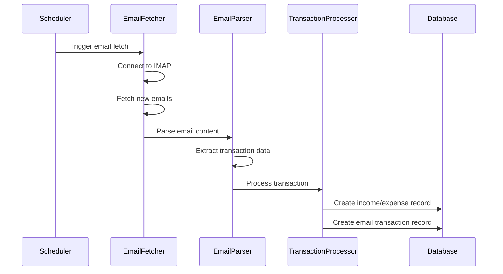

# Email Transaction Automation Design Document

## Overview

The Email Transaction Automation system will integrate with the existing Laravel application to automatically process bank transaction emails and populate the income and expense records. The system will use IMAP to fetch emails, parse transaction data using pattern matching, and create corresponding database entries while maintaining data integrity and audit trails.

## Architecture

### High-Level Architecture



### Component Interaction



## Components and Interfaces

### 1. Email Configuration Management

**EmailConfiguration Model**
- Stores email account credentials (encrypted)
- Manages IMAP connection settings
- Tracks last sync timestamps

**EmailConfigurationController**
- CRUD operations for email accounts
- Connection testing functionality
- Secure credential handling

### 2. Email Fetching Service

**EmailFetcherService**
- Connects to configured email accounts via IMAP
- Filters emails by sender patterns (banks)
- Marks processed emails to prevent duplicates
- Handles connection failures with retry logic

**Interface:**
```php
interface EmailFetcherInterface
{
    public function fetchNewEmails(EmailConfiguration $config): Collection;
    public function markAsProcessed(string $messageId): void;
    public function testConnection(EmailConfiguration $config): bool;
}
```

### 3. Email Parsing Service

**EmailParserService**
- Pattern matching for different bank email formats
- Extracts amount, date, transaction type, and description
- Handles multiple currency formats
- Logs unparseable emails for manual review

**Interface:**
```php
interface EmailParserInterface
{
    public function parseTransaction(EmailMessage $email): ?TransactionData;
    public function addBankPattern(string $bank, array $patterns): void;
    public function getSupportedBanks(): array;
}
```

### 4. Transaction Processing Service

**TransactionProcessorService**
- Creates Income/Expense records based on transaction type
- Prevents duplicate entries
- Handles failed insertions with retry queue
- Maintains audit trail

**Interface:**
```php
interface TransactionProcessorInterface
{
    public function processTransaction(TransactionData $data, EmailMessage $email): bool;
    public function isDuplicate(TransactionData $data): bool;
    public function retryFailedTransactions(): void;
}
```

## Data Models

### EmailConfiguration Model

```php
class EmailConfiguration extends Model
{
    protected $fillable = [
        'name',
        'email',
        'password', // encrypted
        'imap_host',
        'imap_port',
        'imap_encryption',
        'is_active',
        'last_sync_at',
        'bank_patterns' // JSON field for bank-specific patterns
    ];
    
    protected $casts = [
        'password' => 'encrypted',
        'bank_patterns' => 'array',
        'last_sync_at' => 'datetime',
        'is_active' => 'boolean'
    ];
}
```

### EmailTransaction Model

```php
class EmailTransaction extends Model
{
    protected $fillable = [
        'email_configuration_id',
        'message_id',
        'subject',
        'sender',
        'transaction_type', // 'income' or 'expense'
        'amount',
        'transaction_date',
        'description',
        'raw_content',
        'processing_status', // 'pending', 'processed', 'failed'
        'income_id', // nullable
        'expense_id', // nullable
        'error_message'
    ];
    
    protected $casts = [
        'transaction_date' => 'date',
        'amount' => 'decimal:2'
    ];
}
```

### Enhanced Income Model

The existing Income model will be extended to support email transactions:

```php
// Add to existing Income model
protected $fillable = [
    'client_id', // nullable for email transactions
    'total_amount',
    'pending_amount',
    'received_amount',
    'date',
    'source', // 'manual', 'email'
    'description',
    'email_transaction_id' // nullable
];
```

### Enhanced Expense Model

The existing Expense model will be extended:

```php
// Add to existing Expense model
protected $fillable = [
    'expense_name',
    'amount',
    'category',
    'status',
    'date',
    'notes',
    'source', // 'manual', 'email'
    'email_transaction_id' // nullable
];
```

## Error Handling

### Email Connection Failures
- Exponential backoff retry mechanism
- Notification to administrators
- Fallback to manual processing mode

### Parsing Failures
- Log unparseable emails with full content
- Queue for manual review
- Pattern learning suggestions

### Database Failures
- Transaction rollback on partial failures
- Retry queue for failed insertions
- Data integrity validation

### Duplicate Detection
- Check existing records by amount, date, and description
- Configurable similarity threshold
- Manual override capability

## Testing Strategy

### Unit Tests
- EmailParserService pattern matching
- TransactionProcessorService logic
- Model validation and relationships
- Encryption/decryption of credentials

### Integration Tests
- IMAP connection and email fetching
- End-to-end transaction processing
- Database transaction integrity
- Error handling scenarios

### Feature Tests
- Admin interface functionality
- Email configuration CRUD
- Transaction list filtering and display
- Manual sync triggering

### Mock Data
- Sample bank emails for different formats
- Test email accounts with known data
- Simulated IMAP responses
- Edge case scenarios (malformed emails, network failures)

## Security Considerations

### Credential Protection
- Email passwords encrypted at rest
- Secure credential transmission
- Access control for configuration management

### Data Privacy
- Email content stored securely
- Audit logging for all operations
- Data retention policies

### Input Validation
- Sanitize all email content before processing
- Validate extracted transaction data
- Prevent SQL injection in dynamic queries

## Performance Optimization

### Email Processing
- Batch processing of multiple emails
- Parallel processing for multiple accounts
- Incremental sync based on timestamps

### Database Operations
- Bulk insert for multiple transactions
- Indexed queries for duplicate detection
- Connection pooling for high volume

### Caching
- Cache bank patterns for faster parsing
- Store processed email IDs in memory
- Cache configuration settings

## Monitoring and Logging

### Application Logs
- Email fetch operations and results
- Parsing successes and failures
- Transaction creation events
- Error conditions and recovery

### Metrics
- Number of emails processed per hour
- Parsing success rate by bank
- Transaction creation success rate
- System performance metrics

### Alerts
- Failed email connections
- High parsing failure rates
- Database connection issues
- Unusual transaction patterns