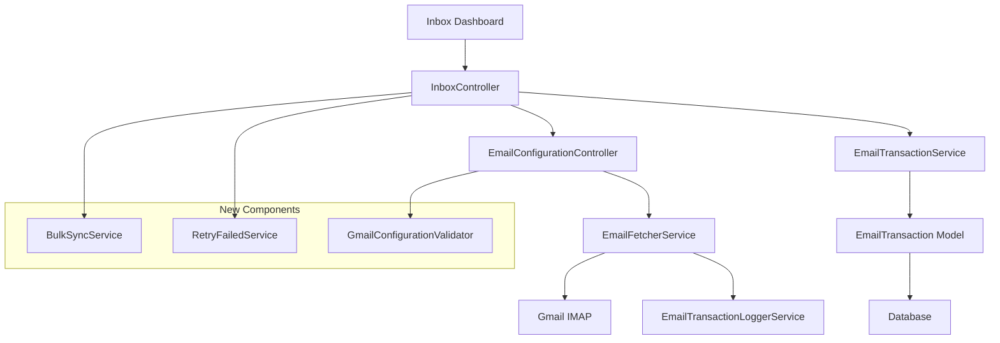

# Design Document

## Overview

This design document outlines the implementation approach for fixing the non-functional buttons on the inbox dashboard and enhancing Gmail email fetching functionality. The system currently has a solid foundation with email configurations, IMAP connectivity, and transaction processing, but lacks proper implementation for bulk operations and comprehensive Gmail support.

The solution focuses on implementing missing controller endpoints, enhancing the existing EmailFetcherService for Gmail-specific functionality, and ensuring robust error handling and user feedback mechanisms.

## Architecture

### High-Level Architecture



### Service Layer Enhancement

The design introduces three new service classes to handle bulk operations:

1. **BulkSyncService**: Manages synchronization of multiple email configurations
2. **RetryFailedService**: Handles reprocessing of failed transactions
3. **GmailConfigurationValidator**: Validates Gmail-specific settings and provides setup guidance

## Components and Interfaces

### 1. Enhanced InboxController

**New Methods:**
- `syncAllActiveAccounts()`: Handles bulk synchronization of all active email configurations
- `retryFailedTransactions()`: Reprocesses failed email transactions
- `getDashboardStats()`: AJAX endpoint for refreshing dashboard statistics

**Responsibilities:**
- Coordinate bulk operations through service classes
- Provide real-time feedback via JSON responses
- Handle error aggregation from multiple operations
- Update dashboard statistics after operations

### 2. BulkSyncService

**Interface:**
```php
interface BulkSyncServiceInterface
{
    public function syncAllActiveConfigurations(): BulkSyncResult;
    public function syncSpecificConfigurations(array $configIds): BulkSyncResult;
    public function getProgress(): array;
}
```

**Key Features:**
- Parallel processing of multiple email configurations
- Progress tracking for long-running operations
- Comprehensive error collection and reporting
- Configurable timeout and retry mechanisms

### 3. RetryFailedService

**Interface:**
```php
interface RetryFailedServiceInterface
{
    public function retryAllFailedTransactions(): RetryResult;
    public function retrySpecificTransactions(array $transactionIds): RetryResult;
    public function identifyRetryableTransactions(): Collection;
}
```

**Key Features:**
- Intelligent failure analysis to determine retry eligibility
- Batch processing of failed transactions
- Detailed retry result reporting
- Prevention of infinite retry loops

### 4. Gmail-Specific Enhancements

**GmailConfigurationValidator:**
- Validates Gmail IMAP settings (host: imap.gmail.com, port: 993, SSL)
- Checks App Password format and validity
- Provides step-by-step setup instructions
- Tests Gmail-specific IMAP features

**Enhanced EmailFetcherService:**
- Gmail-specific error handling for common issues
- Support for Gmail's IMAP extensions
- Optimized folder and label handling
- Enhanced authentication flow for App Passwords

## Data Models

### Enhanced EmailConfiguration Model

**New Attributes:**
```php
// Gmail-specific settings
protected $fillable = [
    // ... existing fields
    'provider_type',        // 'gmail', 'outlook', 'generic'
    'provider_settings',    // JSON field for provider-specific config
    'setup_instructions',   // Generated setup guide
    'last_error_message',   // Last connection error for troubleshooting
    'consecutive_failures', // Track failure count for circuit breaker
];
```

**New Methods:**
- `isGmailConfiguration()`: Check if configuration is for Gmail
- `getGmailSetupInstructions()`: Generate Gmail-specific setup guide
- `incrementFailureCount()`: Track consecutive failures
- `resetFailureCount()`: Reset on successful connection

### New BulkOperation Model

**Purpose:** Track bulk operations for progress monitoring and audit trails

**Schema:**
```php
Schema::create('bulk_operations', function (Blueprint $table) {
    $table->id();
    $table->string('operation_type'); // 'sync_all', 'retry_failed'
    $table->unsignedBigInteger('user_id');
    $table->json('configuration_ids')->nullable();
    $table->string('status'); // 'pending', 'running', 'completed', 'failed'
    $table->integer('total_items');
    $table->integer('processed_items')->default(0);
    $table->integer('successful_items')->default(0);
    $table->integer('failed_items')->default(0);
    $table->json('results')->nullable();
    $table->text('error_message')->nullable();
    $table->timestamp('started_at')->nullable();
    $table->timestamp('completed_at')->nullable();
    $table->timestamps();
});
```

## Error Handling

### Comprehensive Error Strategy

**1. Connection Errors:**
- Gmail-specific error messages (App Password issues, 2FA requirements)
- Network timeout handling with exponential backoff
- IMAP protocol error interpretation

**2. Bulk Operation Errors:**
- Individual configuration failure isolation
- Partial success handling (some configs succeed, others fail)
- Detailed error aggregation and reporting

**3. User-Friendly Error Messages:**
- Gmail setup troubleshooting guides
- Common issue resolution steps
- Contact information for persistent issues

### Circuit Breaker Pattern

Implement circuit breaker for email configurations that consistently fail:
- Track consecutive failures per configuration
- Temporarily disable configurations after threshold (default: 5 failures)
- Automatic re-enabling after cooldown period
- Admin notification for disabled configurations

## Testing Strategy

### Unit Tests

**Service Layer Tests:**
- `BulkSyncServiceTest`: Test parallel processing, error handling, progress tracking
- `RetryFailedServiceTest`: Test retry logic, transaction filtering, result aggregation
- `GmailConfigurationValidatorTest`: Test Gmail validation rules, setup instructions

**Controller Tests:**
- `InboxControllerTest`: Test new endpoints, JSON responses, error handling
- `EmailConfigurationControllerTest`: Test enhanced manual sync with Gmail features

### Integration Tests

**Gmail Integration:**
- Test actual Gmail IMAP connection with test account
- Verify App Password authentication flow
- Test Gmail-specific error scenarios

**Bulk Operations:**
- Test sync operations with multiple configurations
- Test partial failure scenarios
- Test progress tracking accuracy

### Feature Tests

**End-to-End Workflows:**
- Complete Gmail setup and sync process
- Bulk sync with mixed success/failure results
- Failed transaction retry workflow
- Dashboard real-time updates during operations

## Performance Considerations

### Optimization Strategies

**1. Parallel Processing:**
- Use Laravel queues for bulk operations
- Implement job batching for progress tracking
- Configure appropriate queue workers for email processing

**2. Database Optimization:**
- Index email_transactions table on processing_status
- Implement pagination for large transaction lists
- Use database transactions for bulk updates

**3. Memory Management:**
- Stream large email processing operations
- Implement batch processing for retry operations
- Clear processed email data from memory

**4. Caching Strategy:**
- Cache dashboard statistics with 5-minute TTL
- Cache Gmail setup instructions
- Cache processed message IDs for duplicate prevention

## Security Considerations

### Gmail Security

**App Password Handling:**
- Encrypt stored passwords using Laravel's encryption
- Validate App Password format before storage
- Provide secure password update mechanism

**IMAP Security:**
- Enforce SSL/TLS for all Gmail connections
- Validate SSL certificates
- Implement connection timeout limits

### Audit Trail

**Enhanced Logging:**
- Log all bulk operations with user attribution
- Track configuration changes and access
- Monitor failed authentication attempts

## Implementation Phases

### Phase 1: Core Button Functionality
- Implement missing controller endpoints
- Add basic bulk sync and retry services
- Update frontend JavaScript for proper AJAX handling

### Phase 2: Gmail Enhancement
- Add Gmail-specific validation and setup
- Enhance EmailFetcherService for Gmail features
- Implement comprehensive error handling

### Phase 3: Performance & Monitoring
- Add queue-based processing for bulk operations
- Implement progress tracking and real-time updates
- Add comprehensive logging and monitoring

### Phase 4: Advanced Features
- Circuit breaker implementation
- Advanced retry logic with intelligent failure analysis
- Performance optimization and caching